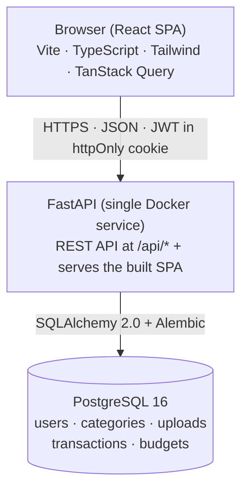
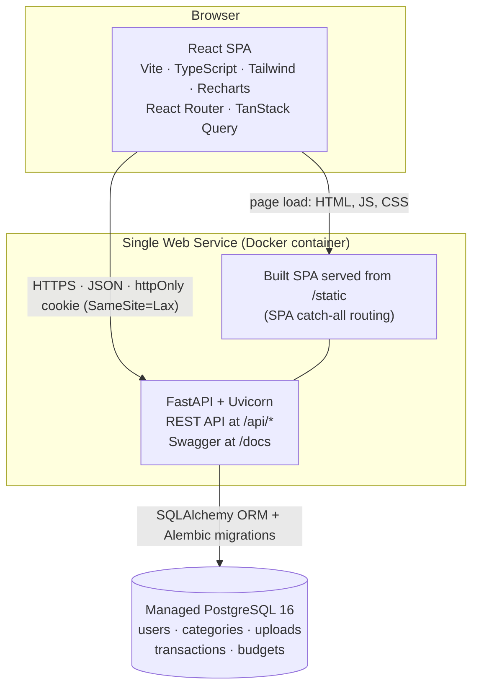
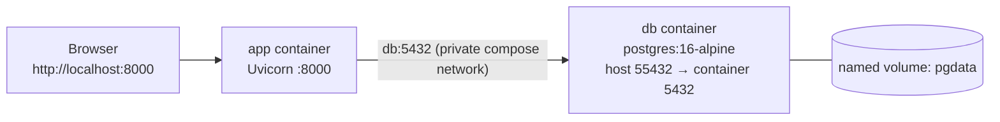
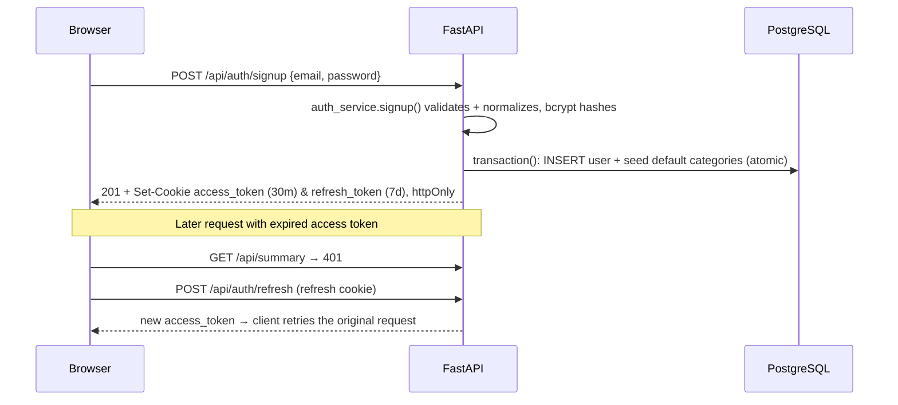
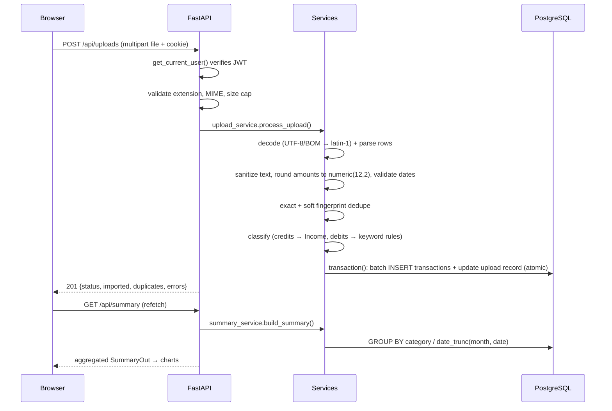
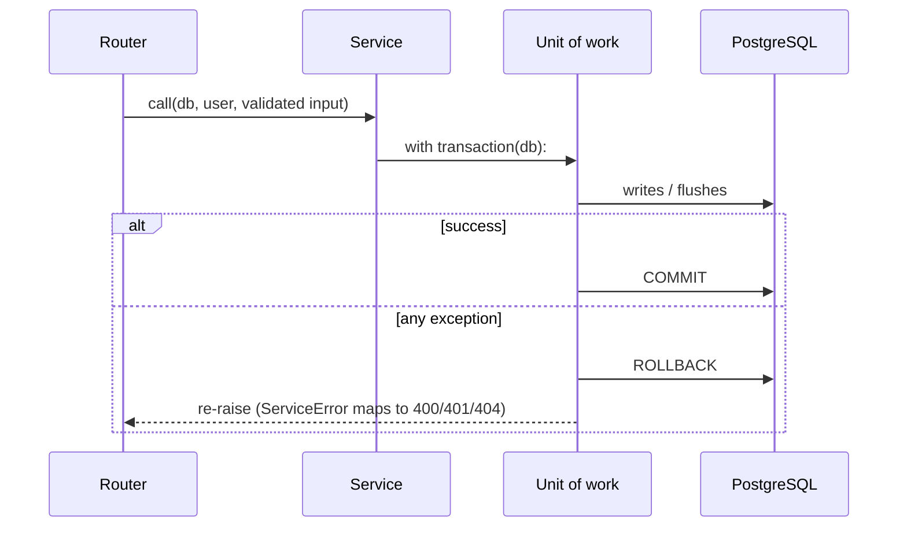
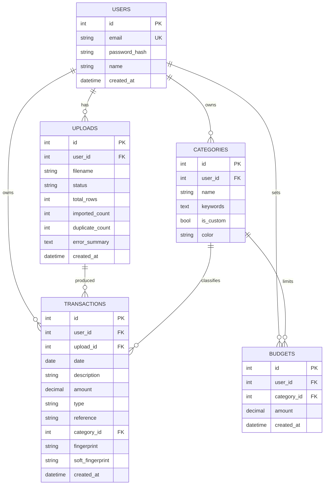
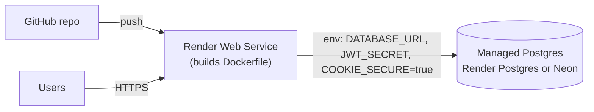

# Architecture & Explanation — Expensify

Fintech Expense Classification & Reporting Tool.
Upload a bank-statement CSV → auto-categorize → interactive dashboard → CSV/PDF export.

> Diagrams below use **Mermaid** — they render on GitHub, VS Code (Markdown Preview
> Mermaid), and most Markdown viewers.

---

## 1. At a glance



---

## 2. System architecture (deployment view)



**Why one service?** The API and the compiled React app ship in the same container, so
there is **one origin** — no CORS, first-party cookies, one deploy. The classic
three-tier split (CDN + API + DB) is documented as the scaling path in §12.

### Local development topology (Docker Compose)



- `docker compose up --build` starts both; the app waits for the DB healthcheck.
- Host port **55432** avoids clashing with a locally installed PostgreSQL on 5432.
- On boot the container runs `alembic upgrade head`, then starts Uvicorn.

---

## 3. Layers

| Layer | Technology | Responsibility |
|---|---|---|
| **Frontend** | React 19, Vite, TypeScript, Tailwind v4, Recharts, TanStack Query, React Router | Login/register, dashboard & charts, transactions table, budgets, insights, exports |
| **API (routers)** | FastAPI (Python), Pydantic v2 | HTTP concerns only: route params, auth dependency, call a service, return a schema |
| **Services** | Python modules | All business logic **and all DB/ORM access**; each write is a transaction unit |
| **Data access** | SQLAlchemy 2.0 + Alembic | ORM models, `transaction()` unit of work (commit/rollback), versioned migrations |
| **Database** | PostgreSQL 16 | Users, categories, uploads, transactions, budgets + indexes and `CHECK` constraints |
| **Packaging** | Multi-stage Dockerfile | Build React → serve static from FastAPI |
| **Orchestration** | Docker Compose | API + database for local/self-hosted runs |

### Backend module layout

```
backend/app/
├── main.py          # app, CORS, router wiring, ServiceError → HTTP handler, serves the SPA
├── config.py        # env settings (+ normalizes PaaS DATABASE_URL)
├── database.py      # engine, session factory, Base, get_db(), transaction() unit of work
├── core/
│   ├── security.py  # bcrypt hashing, JWT create/decode, token fingerprint
│   └── deps.py      # get_current_user() — auth dependency
├── models/          # SQLAlchemy models: user, category, upload, transaction, budget
│                    #   (+ composite indexes and DB CHECK constraints)
├── schemas/         # Pydantic DTOs: request/query validation + sanitization, responses
│   └── common.py    # MessageOut, ErrorOut, HealthOut, shared query models
├── services/
│   ├── auth_service.py, category_service.py, budget_service.py,
│   ├── transaction_service.py, summary_service.py, export_service.py,
│   ├── upload_service.py            # DB access + business logic (transactional)
│   ├── csv_parser.py, classifier.py, dedupe.py, insights.py  # pure logic
│   └── errors.py                    # domain errors (Validation/Conflict/Auth/NotFound)
└── api/             # thin routers: auth, uploads, transactions, categories,
                     #   summary, budgets, insights, export
                     #   (__init__.py = shared 400/401/404 error-response docs)
```

**Design rule:** routers stay thin (validate → call a service → return a schema);
services own **all** database and model access and wrap every write in a
`transaction()` unit of work (commit on success, rollback on failure). Services raise
domain errors from `services/errors.py`, which `main.py` maps to HTTP status codes, so
the service layer has no HTTP concerns and is unit-testable without a server.

---

## 4. Technology choices & rationale

| Decision | Why | Trade-off accepted |
|---|---|---|
| **FastAPI (Python)** | The core is data wrangling (CSV, dates, `Decimal` money, hashing) — Python's stdlib covers it. Pydantic gives validation + **auto Swagger docs** for free. | Not the same language as the frontend (Node/TS would share types). |
| **PostgreSQL** | Relational integrity (FKs, unique dedupe index), exact `numeric(12,2)` money, SQL aggregation for the dashboard. | More rigid than a document store. |
| **SQLAlchemy 2.0 + Alembic** | Mature ORM with typed models and **versioned migrations** — a real production story. | Some boilerplate vs. a lighter ORM. |
| **One service (API serves SPA)** | One URL, no CORS, first-party cookies, one deploy. | Less "microservice". Split documented as the scaling path. |
| **JWT in httpOnly cookie** | Token is invisible to JavaScript → resists XSS token theft. | Needs CSRF consideration → `SameSite=Lax` + non-GET-only state changes. |
| **bcrypt** | Standard, salted, adaptive password hashing; schema caps passwords at 72 bytes (bcrypt's limit). | Slower than SHA by design (good). |
| **pg8000 driver** | Pure Python → no native `libpq`/DLL issues on Windows or Linux; identical behaviour everywhere. | Slightly slower than a C driver (negligible here). |
| **Rule-based classifier** | Transparent, deterministic, unit-testable, and **private** (no data leaves the server). | Misses unknown merchants → mitigated by custom categories, manual override, and learning. |
| **Unit-of-work transactions** | One `transaction()` context manager owns commit/rollback; services never call `commit()` directly, so every write is atomic. | Explicit `with` blocks per write path. |
| **Defense-in-depth validation** | Pydantic sanitizes at the API boundary **and** DB `CHECK` constraints mirror the rules, so bad data can't be persisted even by non-API callers. | Rules live in two places; a migration test keeps them in sync with the models. |
| **Recharts** | Declarative React charts (donut, area, sparklines) with tooltips. | Heavier bundle than a canvas lib. |
| **Docker (multi-stage)** | Reproducible builds; the final image contains only what's needed. | Build cost. |

---

## 5. Data flow

### 5.1 Authentication



### 5.2 CSV upload & categorization (the core flow)



### 5.3 Dashboard, insights, budgets, export

- **Dashboard** — `GET /api/summary?date_from&date_to` aggregates **in the database**
  (total in/out, net, by-category, by-month debit/credit/count, top merchants).
- **Insights** — `GET /api/insights?date_from&date_to` computes rule-based insights
  (period-over-period change, savings rate, top/growing category, top merchant, largest expense).
- **Budgets** — `GET /api/budgets` returns each limit with spend-in-range, percent and over/under.
- **Re-categorize & learn** — `PATCH /api/transactions/{id}` assigns a category, adds the
  merchant phrase as a keyword, reclassifies matching "Other/uncategorized" rows, and
  returns what was learned.
- **Export** — CSV streamed from the DB; PDF generated server-side with ReportLab.
  Rendering lives in `export_service` (`build_csv` / `build_pdf`), the router only sets headers.

### 5.4 Transactions & error handling



- `database.py` exposes one unit-of-work context manager: `transaction(db)` commits on
  success and rolls back on **any** exception, then re-raises. Services never call
  `commit()` directly; all writes are all-or-nothing.
- Read paths use the request-scoped session from `get_db()`; if a request raises, the
  dependency rolls back before closing the session, so a failed request can't leak state.
- Services signal expected failures with domain errors (`ValidationError`, `ConflictError`,
  `AuthError`, `NotFoundError` in `services/errors.py`). The handler registered in
  `main.py` converts them to `{"detail": "..."}` with the right status code; unexpected
  exceptions remain 500s and have already been rolled back.

---

## 6. Database schema



**Key constraints & indexes**

- `transactions` unique index on `(user_id, fingerprint)` → makes re-uploads **idempotent**.
  `fingerprint = sha256(date | description | amount | reference)`.
- `soft_fingerprint = sha256(date | description | amount)` catches overlapping duplicates.
- Composite indexes match the user-scoped access paths (migration `826398539364`):
  - `transactions(user_id, date, id)` — listing/export ordering
  - `transactions(user_id, type, date)` — summary/insights/budget aggregation
  - `transactions(user_id, soft_fingerprint)` — overlap dedupe
  - `transactions(upload_id)` — upload → transactions FK lookups
  - `categories(user_id, name)` — duplicate-name check and "Other" fallback
  - `uploads(user_id, created_at)` — upload history ordering
  - `budgets` unique `(user_id, category_id)` also serves as the user_id index
- DB `CHECK` constraints mirror application validation (migration `c0c83cea6095`):
  non-blank category names, `transactions.type IN ('DEBIT','CREDIT')`,
  `budgets.amount > 0`, `uploads.status IN ('PROCESSING','COMPLETED','FAILED')`,
  and non-negative upload counters.
- `amount` is always positive; direction lives in `type` (`DEBIT`/`CREDIT`).
- **Money is `numeric(12,2)`, never floating point.**

---

## 7. API surface (REST)

Base path `/api`. Everything except `health`, `auth/signup`, `auth/login`, `auth/refresh`
requires an authenticated cookie, and **every query is scoped to the logged-in user**.

| Area | Endpoints |
|---|---|
| **Auth** | `POST /auth/signup`, `/auth/login`, `/auth/logout`, `/auth/refresh`; `GET /auth/me` |
| **Uploads** | `POST /uploads` (multipart), `GET /uploads`, `GET /uploads/{id}` |
| **Transactions** | `GET /transactions` (filters: `date_from`, `date_to`, `category_id`, `type`, `search`; paginated), `GET /transactions/{id}`, `PATCH /transactions/{id}` (re-categorize + learn) |
| **Categories** | `GET/POST /categories`, `PATCH/DELETE /categories/{id}` |
| **Analytics** | `GET /summary`, `GET /insights` (both accept `date_from`/`date_to`) |
| **Budgets** | `GET /budgets`, `PUT/DELETE /budgets/{category_id}` |
| **Export** | `GET /export/csv`, `GET /export/pdf` |
| **Health** | `GET /health` |

Interactive documentation: **`/docs`** (Swagger UI, generated automatically from Pydantic schemas).
Request and query params are typed Pydantic models (e.g. `TransactionQuery`, `DateRangeQuery`),
so bounds (`limit ≤ 1000`, `search ≤ 200` chars, `category_id > 0`, `date_from`/`date_to`)
are enforced before a service runs, and the common 400/401/404 error shapes are documented
per router via `app/api/__init__.py`.

---

## 8. Security considerations

- **Per-account isolation** — a `user_id` column on every table; every query filters on the
  authenticated user, so one account can never read or mutate another's data.
- **`httpOnly` cookie tokens** — JavaScript cannot read the access/refresh tokens, mitigating
  XSS token theft. `SameSite=Lax` blocks cross-site cookie riding (CSRF).
- **Short-lived access + refresh** — access ≈ 30 min, refresh 7 days; the client silently
  refreshes on `401`, and an unrecoverable `401` forces a clean re-login.
- **Token fingerprint (`uv`)** — tokens embed a hash of the password hash; a token can never
  be accepted for a different account, and changing a password invalidates old sessions.
- **bcrypt** password hashing (one-way, salted, adaptive), with the 72-byte bcrypt input
  limit enforced by the request schema (422 instead of a 500).
- **Input validation & sanitization** — Pydantic validates every request body/query before
  it reaches a service, and normalizes values (trim/collapse whitespace, lowercase email,
  dedupe/lowercase keywords, validate hex colors, cap lengths).
- **DB-level constraints** — `CHECK` constraints mirror the app rules, so even a caller that
  bypasses the API cannot persist blank names, invalid types/statuses or non-positive budgets.
- **Upload hardening** — extension + MIME sniffing, size cap, per-row sanitization (truncate
  to column limits, round money to 2 dp), atomic import (single transaction, no partial rows).
- **Atomic writes** — every mutation goes through `transaction()`: commit on success, rollback
  on any failure, so requests can never leave half-applied state.
- **Privacy** — rule-based classification means financial text is never sent to a third party.
- **Ownership checks** — category/budget/transaction operations verify ownership before writing.
- **Money precision** — `numeric(12,2)` avoids float rounding.

**Planned hardening:** per-user rate limiting on auth, refresh-token rotation/revocation,
audit log, and `COOKIE_SECURE=true` under HTTPS.

---

## 9. Deployment



**Single-service deployment (chosen):**

1. Push the repository to GitHub.
2. Render → **New → Web Service** → select the repo, **Runtime = Docker**.
3. Create a free **PostgreSQL** (Render Postgres or Neon) and set `DATABASE_URL`.
4. Set `JWT_SECRET` (long random) and `COOKIE_SECURE=true`.
5. Deploy — the container runs `alembic upgrade head` then serves API + SPA on one URL.

**Why it needs no code changes:** `get_database_url()` normalizes the provider's
`postgres://…` URL to the driver scheme; the frontend calls relative `/api/*` (same origin).

**Environment variables**

| Variable | Purpose |
|---|---|
| `DATABASE_URL` | Postgres connection (auto-normalized) |
| `JWT_SECRET`, `JWT_ALGORITHM` | Token signing |
| `ACCESS_TOKEN_EXPIRE_MINUTES`, `REFRESH_TOKEN_EXPIRE_DAYS` | Token lifetimes |
| `MAX_UPLOAD_MB`, `MAX_UPLOAD_ROWS` | Upload limits |
| `CORS_ORIGINS` | Allowed origins (local dev) |
| `COOKIE_SECURE` | `true` behind HTTPS |
| `STATIC_DIR` | Where the built SPA lives |

**Alternative split:** Vercel (frontend) + Render (API) + Neon (DB) — more "microservice",
but adds CORS, cross-site cookies and two deploys. Rejected for reliability within scope.

---

## 10. Edge cases & fault tolerance

| Case | Handling |
|---|---|
| Malformed / corrupt CSV | Extension + MIME sniffing; header validation; per-row skip-and-count; UTF-8 (BOM) → latin-1 fallback; `FAILED` status with an error summary |
| Oversized / dirty row values | Whitespace collapsed, text truncated to column limits, amounts rounded half-up to 2 dp, dates bounded to 1900–2100; unparseable rows skipped + counted |
| Duplicate / overlapping transactions | Two-tier dedupe — exact via unique `(user_id, fingerprint)`, overlapping via soft fingerprint; both skipped + counted |
| Session expiry mid-upload | Access + refresh tokens; silent refresh-and-retry on `401`; atomic single-transaction import |
| Failure mid-write | `transaction()` rolls back the whole unit of work, so no partial rows or half-learned keywords persist |
| Long password (>72 bytes) | Rejected at the schema boundary (422) instead of failing inside bcrypt (500) |
| Large files | 10 MB / 50k-row caps; streamed reads; ~1000-row batch flushes; DB-side aggregation; paginated lists |
| Unknown merchant | Falls to "Other"; one-click re-categorize **teaches** a keyword and reclassifies matches |
| Credits misread as spend | All credits route to `Income` |

---

## 11. Testing

| Suite | What it covers | How to run |
|---|---|---|
| `backend/tests/` | Unit + API tests via FastAPI `TestClient` against a disposable Postgres DB: auth, upload/dedupe, classifier, learning, budgets, exports, per-user isolation, schema validation, transaction commit/rollback, migration cycle | `backend/.venv/Scripts/python.exe -m pytest` |
| `backend/tests/test_migrations.py` | Alembic **upgrade → downgrade → upgrade** on a throwaway DB, plus an autogenerate diff proving migrations match the ORM models | included above |
| `backend/integration_tests/` | Live-server end-to-end: every endpoint, concurrency/idempotency races, edge cases, export integrity (stress cases opt-in via `RUN_STRESS=1`) | `docker compose up -d`, then `pytest integration_tests` |
| `loadtests/` | k6 load/stress scripts + generated fixture CSVs and results | see `loadtests/` |

---

## 12. Scalability roadmap (if this were production)

- Split the SPA (CDN/Vercel) from the API; add a load balancer + horizontal API replicas.
- Managed Postgres with read replicas; cache hot `summary`/`insights` queries.
- Move CSV processing to a background worker (Celery/RQ) with async upload-status polling.
- Add per-user rate limiting, refresh-token rotation, an audit log, and observability.
- Route-level code splitting on the frontend to trim the JS bundle.
